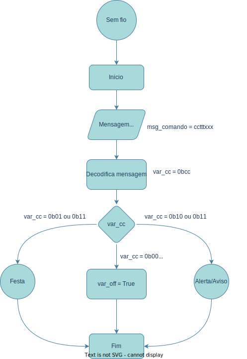

# `Pulseira Inteligente`
# `Smart Bangle`

## Apresentação

O presente projeto foi originado no contexto das atividades da disciplina de graduação *EA075 - Sistemas Embarcados*, 
oferecida no segundo semestre de 2022, na Unicamp, sob supervisão da Profa. Dra. Paula Dornhofer Paro Costa, do Departamento de Engenharia de Computação e Automação (DCA) da Faculdade de Engenharia Elétrica e de Computação (FEEC).

> 
> |Nome  | RA | Curso|
> |--|--|--|
> | Rafael Cirino | 223730  | Eng. Elétrica|
> | Tarciso Hattum | 224622 | Eng. Elétrica|

## Arquivos Importantes
> - **[Esquemático em PDF](https://github.com/Rafael-Cirino/EA075-smart_bangle/tree/main/2022.2/smart_bangle/pdf)**
> - **[Lista de Componentes](https://github.com/Rafael-Cirino/EA075-smart_bangle/blob/main/2022.2/smart_bangle/components.md)**
> - **[PCB](https://github.com/Rafael-Cirino/EA075-smart_bangle/tree/main/2022.2/smart_bangle/3d_models)**

## Descrição do Projeto
> Seja em lugares com muitas ou poucas pessoas é necessário que a empresa administradora do local possua controle sobre o acesso de público, monitore a sua permanência durante evento ou interaja com ele proporcionando a melhor experiência possível, criando assim uma lembrança afetiva entre a marca e o cliente.
>  
> Tendo em vista o que foi mencionado acima, o projeto tem como objetivos principais facilitar o controle e permitir uma maior interação com o público em grandes eventos, seja shows, parque de diversões/aquáticos, eventos esportivos etc. Além disso, pode ser utilizada para pequenas aplicações, por exemplo restaurantes, onde o seu uso seria indicado para registro de comanda e aviso de liberação de mesa.
> 
> O projeto em si, é uma pulseira que possui comunicação sem fio, um identificador RFID, led, sistema vibra-call e é prova d' água. Abaixo, como exemplo, estão listados alguns cenários de uso:
> - Show
>   - Proporcionar uma experiência sensorial memorável ao público, onde todos estão com a pulseira e a partir de comandos enviados por uma central para elas, é possível sincronizar o acionamento dos leds, fazendo com que diferentes partes do público pisquem em determinada cor e intensidade, criando um mosaico e um efeito luminoso.
> - Parque aquático e de diversões 
>   - Através do RFID é possível monitorar a entrada do público em brinquedos, bem como fornecer alertas na pulseira a partir de sinais enviados por uma central e proporcionar uma experiência coletiva entre os visitantes.
> - Restaurantes
>   - Em restaurantes, a smart bangle substitui os antigos pagers que avisam quando a mesa está liberada, além disso, ela pode ser utilizada na hora de resgitro da comanda. Atualmente em muitos estabelecimentos garçons utilizam tablet ou celular para registar os pedidos, só quem ainda é necessário que haja uma numeração das mesas, que cria um outro problema, dificuldade na criação de comandas separadas, a smart bangle resolve, pois com cada cliente usando uma pulseira, a partir da identificação RFID, o garçom consegue encostar o tablet ou telefone nela e assim gerar o pedido para a comanda daquele cliente em especifico. 
>

## Descrição Funcional
### Funcionalidades
> - **Comunicação sem fio**: responsável pela comunicação via rádio frequência entre a central e a pulseira com o auxílio de uma antena;
> - **Acionar LED**: atuador é acionado ao receber algum sinal de controle da central. Um exemplo seria num show onde a smart bangle receberia sinais de controle com o objetivo de sincronizar todas as pulseiras com certa cor e certa frequência;
> - **Vibrar**: atuador é acionado ao receber algum sinal de controle da central. Por exemplo, a smart bangle vibra com o intuito de avisar/alertar o usuário de algum evento próximo importante;
> - **RFID**: Fornecer uma identificação única para a pulseira.
> - **Carregamento por indução**: com o auxílio de bobinas, o carregamento por indução é responsável por garantir que o produto esteja com uma bateria adequada para uso e também por carregar simultaneamente diversos aparelhos;
> - **Prova d'agua**: pensado na aplicação de uso em parques aquáticos, a pulseira a prova d'agua garante maior durabilidade e necessita de forte isolamento;
> - **Bateria de longa duração**: uma bateria de longa duração é necessária para durar todo o evento.

### Configurabilidade
> - **Antena:** Sistema de entrada de dados via rádio frequência com banda de 142 a 1050 MHz
> - **Led RGB:** Sistema de saída com três diodos emissores de luz em vermelho, verde e azul.
> - **Atuador vibra-call:** Sistema de saída com nano atuador de vibra call
> - **Tag RFID:** Tag configurado com um id especifico para a smart bangle
> - **Bateria:** Aproximadamente 500 mAh, para durar cerca de 16h.
> - **Microcontrolador:** Com baixo consumo de energia, que permita interrupção, não é necessário grande capacidade de processamento e que permita codificar sinais de rede sem fio.
> - **Bobina para carregamento por indução:** Bobina de carregamento 5V que suporte pelo menos 1000mA de corrente
> - **Circuitos eletrônicos:** 
>	  - Capacitores;
>	  - Resistores;
>	  - Diodos;
>	  - Indutores;
>	  - Receptores;
>	  - Interfaces de entrada e saída;
>	  - Cristal de clock;
>	  - Regulador de tensão;
>	  - Decodificador;
>	  - Circuito de alimentação;
>	  - Icsp;

### Eventos
> | Evento  | Periodicidade | Prioridade |
> |--|--|--|
> |Sem fio | Média | Alta |;
> |Led | Média | Média |;
> |Vibra-call | Baixa | Média |;
> |Carregamento | Baixa | Média |;
> |Economia de energia | Baixa | Alta |;
> |Alerta/Aviso | Média | Alta |;
> |Festa | Média | Alta |
> |Relógio TC | Média | Alta |;

### Tratamento de Eventos
> - **Stand by**: No modo espera somente o circuito de comunicação sem fio fica ativo, esperando algum comando externo para atuar.
> - **Sem fio**: Disparado quando há alguma comunicação externa, decodifica o sinal recebido e determina a ação necessária.
> - **LED**: Ativação os leds com determinada frequência e cor.
> - **Atuador vibra-call**: Pulseira irá vibrar por um determinado período.
> - **Carregamento**: Quando algum sistema de indução é conectado, uma interrupção é gerada e a smart bangle entra no estado carregamento.
> - **Economia de energia**: o bloco de processamento verifica se a smart bangle está com bateria baixa (bateria < 10%). Se sim, vai para o modo economia de energia, aciona um LED de estado (bateria baixa: led vermelho, carregando: led azul) e a conexão sem fio é cortada;
> - **Alerta/Aviso**: identifica a mensagem via conexão sem fio e se for necessário, gera um aviso, acionando vibra call e/ou o LED RGB;
> - **Festa**: identifica mensagem via conexão sem fio, entra no modo festa que faz o acionamento do LED com frequências específicas;
> - **Relógio TC**: Todo momento que o relógio TC atingir um tempo pré configurado, é ocasionado uma interrupção e realizado um controle sobre os leds e/ou vibra call

## Descrição Estrutural do Sistema
>
> - Primeiramente a smart bangle se encontra no modo "Stand By". Ela verifica se há baixa bateria ou não. Caso sim, ela entra no modo "economia de energia";
>
> - No modo "economia de energia" é desligado o módulo conexão sem fio, é acionado o LED vermelho e volta ao modo "Stand By";
> 
> - Ao ser conectado ao sistema de carregamento por indução, entra no modo carregamento, ativa a conexão sem fio e vai para o "LED Estado";
> 
> - O "LED Estado" define a cor do LED acendido: ao estiver carregando o led azul será aceso e quando estiver com a carga 100% o led verde será aceso;
>
> - Caso a bateria esteja compatível, ela começa a comunicação sem fio;
>
> - O modo "sem fio" recebe a mensagem e decodifica para o acionamento dos comandos;
>
> - O estado "Alerta/Aviso" identifica se será necessário o acionamento do LED e/ou do vibra-call;
>
> - O estado "Festa" vai processar a frequência e a cor de ativação os LEDs;
>

## Especificações

### Especificação Estrutural

> - **[Micro vibracall 1027](https://www.filipeflop.com/produto/motor-de-vibracao-1027/)**: atuador responsável por alertar através da vibração sempre que algum evento ocorra. Ele opera numa tensão entre 2,5V a 4V, podendo chegar a uma corrente de operação de 90mA e conta com uma velocidade de 9000 RPM. Suas dimensões são milimétricas: 40 x 10 x 3;
> - **[Microcontrolador Atmel SAM D20](https://datasheet.octopart.com/ATSAMD20E17A-AU-Atmel-datasheet-20681123.pdf)**: dispositivo microcontrolador de uso geral da série ARM Cortex-M0+ de alto desempenho e de baixo consumo de energia, além de oferecer um alto grau de flexibilidade para o hardware. Os dispositivos SAM D20 operam a um limite de frequência máxima de até 40MHz, com uma performance de 2,14 Coremark/MHz e periféricos otimizados. Eles são projetados para uma migração simples e intuitiva com módulos periféricos idênticos e permitem uma comunicação autônoma, configurável e de baixa latência entre os periféricos. Alguns desses periféricos podem ser configurados para responder ou emitir sinais de evento. A unidade central de processamento do microcontrolador não interage da comunicação entre os próprios periféricos, ou seja, eles comunicam-se diretamente entre si, reduzindo o consumo geral de energia. O dispositivo também conta com módulos de comunicação serial (SERCOM) totalmente configuráveis de até 6 canais que podem ser configurados cada um destes, por software, para atuar como USART, UART, SPI e I²C até 400 kHz. Com vários módulos SERCOM em um dispositivo, você pode adaptar a combinação de periféricos precisamente à sua aplicação;
> - **[Chip rádio frequência Si4362](https://www.silabs.com/documents/public/data-sheets/Si4362.pdf)**: dispositivo receptor de alto desempeno e baixa corrente que cobrem as bandas de frequência de 142 a 1050 MHz. Ele é responsável por receber, amplificar e demodular dados para cada smart bangle. Esses dados podem ser trabalhados no Microcontrolador fazendo com que os LEDs RBG sejam acionados conforme solicitado. O receptor Si4362 conta com uma ampla faixa de tensão de operação (1,8V a 3,6V) e um baixo consumo de corrente. O sinal recebido é recebido e convertido para a esfera digital através de um conversor analógico digital (ADC) interno. Esse sinal modulado é enviado para o sistema microcontrolador (MCU) através de um GPIO ou via barramento pelo protocolo SPI e é projetado para suportar taxas de dados de 100 bps a 1 Mbps;
> - **[Chipset STEVAL-ISB038V1R](https://www.st.com/resource/en/user_manual/um2098-getting-started-with-the-stevalisb038v1r-wearable-wireless-power-receiver-based-on-stwlc04-stmicroelectronics.pdf)**: dispositivo miniaturizado responsável pelo carregamento de bateria de íon ou lítio sem fio, por indução eletromagnética. Ele permite a transferência de energia de até 1W com bobinas menores comparado a outros dispositivos do mercado (bobinas de 11 milímetros de diâmetro), mas pode ter a capacidade de transferência aumentada usando bobinas maiores. A interface serial de comunicação utilizada é o I²C. Suas dimensões são 3,12 mm por 4,73 mm;
> - **[Oscilador de cristal GRX-210](https://www.digchip.com/datasheets/parts/datasheet/2/943/GRX-210.php)**: dispositivo de cerâmica com dimensões milimétricas (1,6 x 1,2 x 0,45) selado a vácuo permitindo assim uma estabilidade térmica (-40C a +125°C). Sua frequência de alcance está entre 26,0 a 40 MHz;
> - **[Bateria CR2025](https://api.pim.na.industrial.panasonic.com/file_stream/main/fileversion/246927)**: bateria de dióxido de lítio manganês cuja suas características se dá por uma boa capacidade de pulso, alta descarga, nível de tensão estável durante a descarga e resistência à corrosão. O componente conta com uma tensão nominal de 3V, capacidade de corrente nominal de 165 mAh, peso de 2,3g e ampla faixa de temperatura operacional (-30°C á 85°C). Sua dimensão é de 20.0mm x 2.5mm e será usada duas unidades em paralelo para se obter o dobro de corrente com a mesma tensão (3 V);
> - **[Regulador de tensão AMS1117](http://www.advanced-monolithic.com/pdf/ds1117.pdf)**: com o uso do vibracall surge a necessidade de um regulador de tensão, nesse caso o dispositivo é o AMS1117. O dispositivo é um regulador de baixa tensão e conta com uma corrente de carga de 1 A, corrente de espera muito baixa de 2 mA e tem uma baixa tensão de queda de 1,3 V quando operando em corrente máxima. tensão de saída pode variar de 1,5V a 5V. Sua faixa de temperatura operacional se dá entre -40° C to 125° C.
> - **Tag RFID passiva**: Circuito composto por uma antena e um chip
 
### Especificação de Algoritmos 

A seguir são definidos os algoritmos para cada evento e uma aproximação para a quantidade de memória necessária

#### Main

> A seguir temos o fluxograma do nosso algoritmo principal a main, ela é responsável por fazer o processo de incialização do sistema deixando-o pronto para receber comandos. Após inicializar os módulos, o sistema fica em loop até que seja desligado, enquanto isso não acontece ele fica sujeito a interrupção dos eventos em standby, entretanto, se a bateria estiver baixa, o estado de economia será ativado, e o sistema fica inerte até que seja conectado ao carregador.

#### Carregamento e economia

> O evento Economia de energia é ativado quando a bateria se encontra abaixo de 20%, com isso ele incializa o led de estado e o ativa na cor vermelha.

> Quando uma carga por indução for conectada será gerada uma interrução que chama o evento carregamento, que também controla o led de estado, desligando-o caso a carga seja desconectada ou ativando a cor conforme o nível de bateria vai aumentando.

#### Comunicação sem fio

> Este algoritmo é acionado quando há uma interrupção causada pelo envio de uma mensagem, após recebe-la ele processa ela, seguindo o seguinte formato em binário cctttrgb, podendo ser decodificada através de uma mascara de bit
> - cc: Seleciona o modo de operação do relógio
>   - mascara: 0b11000000
> - tt: Seleciona o tempo de operação, serve tanto para o vibra call, quanto para os leds
>   - mascara: 0b00111000
> - xxx: Esse valor conrreponde a cor de ativação do led ou ao número de vezes que o vibracall vai vibrar.
>   - mascara: 0b00000111
 
 Os modos de operação são definidos conforme a seguinte tabela
 
 | cc | Tarefa |
 | -- | -- |
 | 00 | Desliga pulseira |
 | 01 | Chama o evento festa |
 | 10 | Chama o evento Alerta/Aviso |
 | 11 | Chama o evento Festa e depois Alerta/Aviso |

#### Evento festa

> Este evento é chamado após a decodificação da mensagem pelo envento comunicação sem fio, aqui são ativados os módulos necessários para acionamento do led(rgb e TC). Para definir qual led será acionado segue se a seguinte padronização, xxx = rgb, ondea cada bit conrresponde a um led. Para ativar a cor é utilizado como referência a imagem abaixo, quando estão todos acionados se tem a cor branca, e assim serve para as demais.

> Para ativar o tempo de acionamento é utilizado o relógio interno do processador TC. Como o olho humano pisca a cada 0.2s, foi definido como tempo base 0.25s, desse modo quando temos ttt=0 -> 0s, ttt=1 -> 0.25s, ttt=2 -> 0.5s ... ttt=7 -> 1.75s, desse modo, é possível configurar um tempo de delay de 0.25s até 1.75s.

#### Evento alerta/aviso

> Este evento é chamado após o processmento da mensagem, primeiramente é definido quantas vezes o módulo vai vibrar tendo como o base o valor 3, portanto, se vvv=1 -> 3 vezes, vvv=2 -> 6 vezes ... vvv=7 -> 21 vezes. E o tempo entre cada vibração tem como base 0.5s, caso ttt=1, vibra por 0.5s e fica sem vibrar por 0.5s, isso será feitos conforme o número de vezes difinido em vvv.

#### Relógio TC

> Acionado via interrupção conforme o tempo definido no evento festa ou Alerta/Aviso. Primeiramente verifica se precisa acionar o led, caso seja acionado muda a variável led_pisca para False, desse modo, na próxima interrupção o led será apagado criando o efeito de pisca pisca. No próximo if ele analisa se precisa acionar o vibra call, aciona e decrementa 1 da variável que armazenar a quantidade de acionamentos faltantes.

#### Memória

> A seguir temos uma previsão de memória ocupada, ela foi feita com base nas variáveis que serão criadas e com uma estimativa retirada dos labs de EA871 para a incialização dos módulos. Considerando uma margem de erro de 50% temos que a memória mínima necessária é de aproximadmente 30KB.

### PCB

Na imagem a seguir temos o circuito desenvolvolvido no kicad, conforme especificações estruturais aqui definidas.

## Referências
> - https://pvieito.com/2016/09/xyloband-reverse-engineering
> - https://www.instructables.com/Hacking-a-Xyloband-With-Arduino/
> - https://blog.hqcodeshop.fi/archives/395-Xyloband-Whats-inside-one.html
> - https://www.nutsvolts.com/magazine/article/august2013_Bates
> - https://www.renesas.com/us/en/products/power-power-management/wireless-power/introduction-to-wireless-battery-charging
> - https://www.st.com/content/ccc/fragment/corporate/event_information/event_image/group0/26/e3/25/71/fe/52/42/0c/APEC2018_WirelessCharging/files/APEC2018_WirelessCharging.pdf/jcr:content/translations/en.APEC2018_WirelessCharging.pdf
> - https://www.atlasrfidstore.com/rfid-insider/active-rfid-vs-passive-rfid
> - https://www.devmedia.com.br/fluxogramas-diagrama-de-blocos-e-de-chapin-no-desenvolvimento-de-algoritmos/28550
> - https://www.digchip.com/datasheets/parts/datasheet/2/943/GRX-210.php
> - https://embarcados.com.br/atmel-sam-d20-arm-cortex-m0/
> - https://datasheet.octopart.com/ATSAMD20E17A-AU-Atmel-datasheet-20681123.pdf
> - https://www.silabs.com/documents/public/data-sheets/Si4362.pdf
> - https://www.st.com/resource/en/user_manual/um2098-getting-started-with-the-stevalisb038v1r-wearable-wireless-power-receiver-based-on-stwlc04-stmicroelectronics.pdf
> - https://api.pim.na.industrial.panasonic.com/file_stream/main/fileversion/246927
> - http://www.advanced-monolithic.com/pdf/ds1117.pdf
